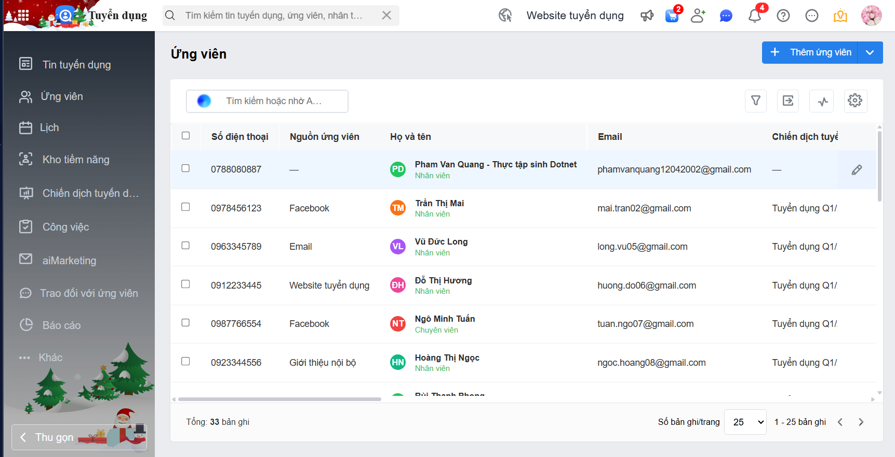
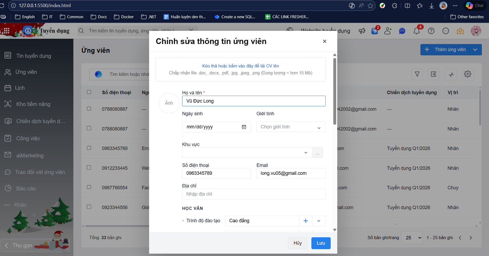
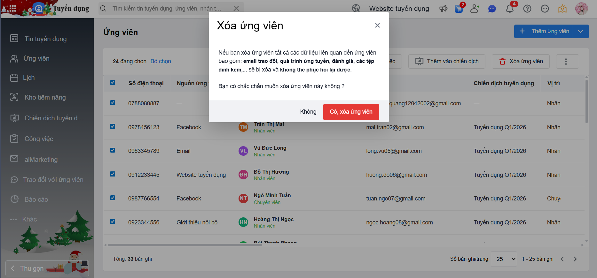
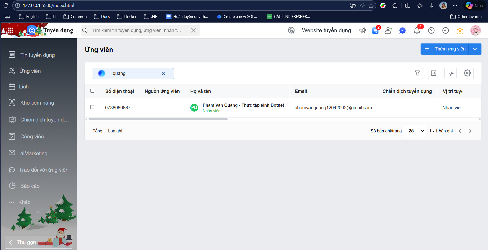

# Demo giao diện danh sách ứng viên (AMIS Tuyển dụng)

## Chức năng

### 1. Hiển thị danh sách ứng viên
- Lấy dữ liệu từ localStorage
- Hiển thị danh sách ứng viên dưới dạng bảng

### 2. Thêm mới ứng viên
- Hiển thị popup thêm ứng viên
- Nhập thông tin ứng viên
- Lưu dữ liệu vào localStorage

### 3. Sửa thông tin ứng viên
- Hiển thị popup sửa thông tin
- Load dữ liệu ứng viên lên form
- Cập nhật và lưu lại vào localStorage

### 4. Chọn ứng viên & toolbar thao tác
- Chọn một hoặc nhiều ứng viên bằng checkbox
- Hiển thị toolbar khi có ứng viên được chọn
- Cho phép:
  - Xoá ứng viên đã chọn
  - Bỏ chọn tất cả

### 5. Tìm kiếm ứng viên
- Tìm kiếm theo:
  - Họ tên
  - Email
  - Số điện thoại

### 6. Validate dữ liệu
- Validate thông tin khi thêm mới / chỉnh sửa ứng viên
- Kiểm tra các trường bắt buộc

### 7. Phân trang
- Phân trang danh sách ứng viên
- Chuyển trang trước / sau
- Hiển thị tổng số bản ghi và số bản ghi trên 1 trang

